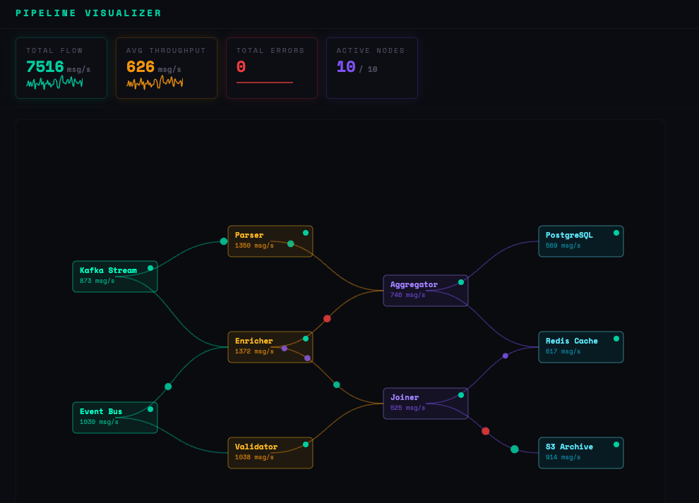

# Pipeline Visualizer

A real-time data pipeline visualization tool that renders live node graphs, animated packet flows, and key throughput metrics. Useful for understanding how data moves through multi-stage streaming systems.



> **No backend required** — the frontend ships with a built-in simulator so it runs standalone out of the box.

---

## Tech Stack

| Layer | Technology |
|---|---|
| Frontend | React 18, Vite, D3.js |
| Backend | Go 1.21, Gorilla WebSocket |
| Deployment | Docker, Docker Compose |

---

## Features

- **Live graph** — nodes, directed edges, and animated data packets moving along the pipeline
- **Node types** — Sources, Transforms, Aggregators, and Sinks, each with distinct colors and metrics
- **Packet animation** — data, error, and control packets rendered in real time along Bézier paths
- **Metric cards** — total flow, average throughput, error count, and active node count with sparklines
- **WebSocket streaming** — backend pushes updates every 100ms; frontend falls back to local simulation if backend is unreachable
- **REST snapshot** — `GET /api/state` returns the latest pipeline state as JSON

---

## Quick Start

### Frontend only (no backend needed)

```bash
cd frontend
npm install
npm run dev
```

Open [http://localhost:5173](http://localhost:5173). The frontend simulates the pipeline locally.

### Full stack (frontend + backend)

**Backend:**

```bash
cd backend
go mod tidy
go run .
# Runs on http://localhost:8080
```

**Frontend:**

```bash
cd frontend
npm install
npm run dev
# Runs on http://localhost:5173
```

### Docker (both services together)

```bash
docker compose up --build
```

| Service | URL |
|---|---|
| Frontend | http://localhost:4173 |
| Backend | http://localhost:8080 |

---

## API

| Method | Endpoint | Description |
|---|---|---|
| `GET` | `/api/health` | Health check |
| `GET` | `/api/state` | Current pipeline state snapshot |
| `GET` | `/ws` | WebSocket stream of live updates (100ms interval) |

---

## Project Structure

```
pipeline-visualizer/
├── backend/
│   ├── main.go          # Go server: WebSocket hub, pipeline simulation, REST API
│   ├── go.mod
│   └── Dockerfile
├── frontend/
│   ├── src/
│   │   ├── PipelineVisualizer.jsx  # Main component: graph, packets, metrics
│   │   ├── App.jsx
│   │   └── styles.css
│   ├── package.json
│   ├── vite.config.js
│   └── Dockerfile
└── docker-compose.yml
```

---

## Configuration

The frontend resolves the backend URL automatically:

| Environment Variable | Default | Description |
|---|---|---|
| `VITE_WS_URL` | `ws://localhost:8080/ws` | WebSocket endpoint |
| `VITE_API_BASE_URL` | `http://localhost:8080` | REST API base URL |
| `PORT` | `8080` | Backend listen port |
